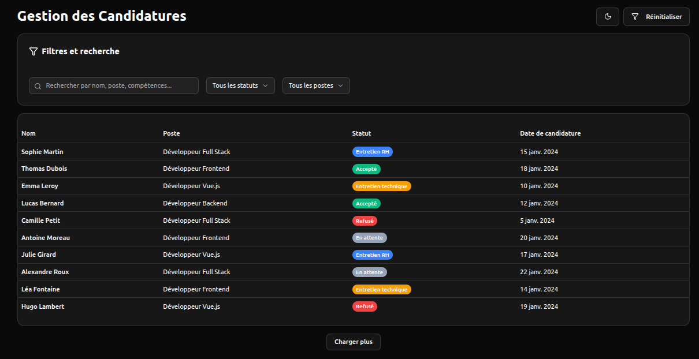
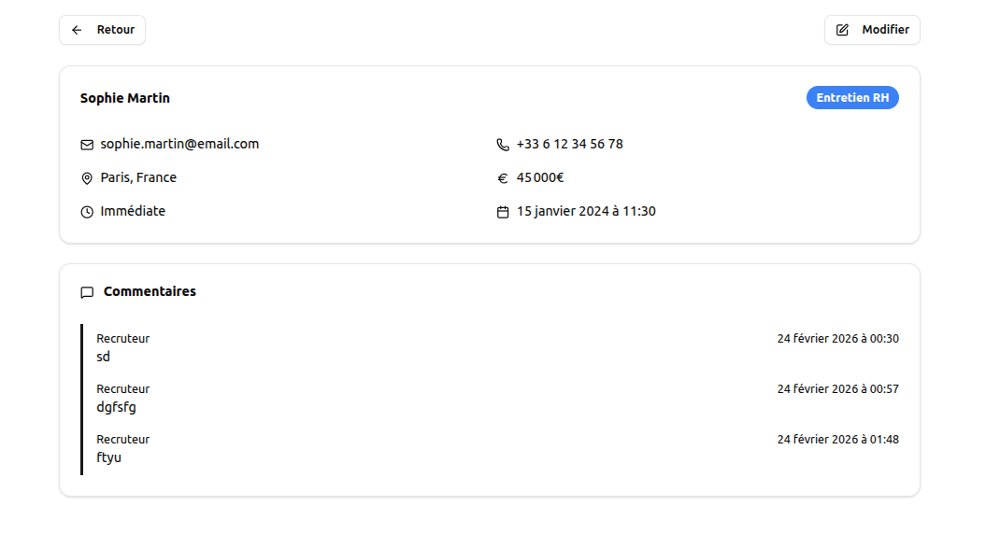

# Application de Gestion de Candidatures

## ⚠️ Instructions claires pour lancer JSON Server

Pour lancer l'API JSON Server, utilisez la commande suivante :

```bash
npm run api
```

Cela démarre JSON Server sur le port 3000 avec le fichier `db.json` comme base de données.

## Instructions d'installation de l'application Vue.js

1. Assurez-vous d'avoir Node.js installé (version 16 ou supérieure).
2. Clonez le repository.
3. Installez les dépendances :

```bash
npm install
```

## Commandes pour lancer l'API et l'application simultanément

Pour lancer l'API et l'application en même temps, utilisez la commande suivante :

```bash
npm run api & npm run dev
```

Cela démarre JSON Server en arrière-plan et lance l'application Vue.js avec Vite.

## Temps passé sur chaque partie

- Configuration initiale et installation des dépendances : 30 minutes
- Développement de l'interface utilisateur (composants Vue) : 2 heures
- Intégration de l'API avec Vue Query : 1 heure
- Gestion de l'état avec Pinia : 45 minutes
- Stylisation avec Tailwind CSS et shadcn/ui : 1 heure 30 minutes
- Tests et débogage : 30 minutes
- Rédaction de la documentation : 15 minutes

## Choix techniques et justifications

- **Vite** : Outil de build rapide pour le développement.
- **Pinia** : Gestion d'état simple et performante pour Vue 3.
- **Vue Query** : Gestion des requêtes API avec cache automatique et gestion des erreurs.
- **Tailwind CSS** : Framework CSS utilitaire pour un développement rapide et cohérent.
- **shadcn/ui** : Composants UI accessibles et modernes, basés sur Tailwind.

Ces choix permettent une développement rapide, une bonne performance et une expérience utilisateur fluide.

## Captures d'écran de l'interface




## Liste des améliorations possibles si plus de temps

- Ajouter des tests unitaires et d'intégration avec Vitest.
- Ajouter des filtres et une recherche avancée dans la liste des candidatures.
- Optimiser les performances avec la virtualisation pour de grandes listes.
- Améliorer l'accessibilité (ARIA, navigation clavier).

## Scripts dans package.json

Le fichier `package.json` contient les scripts suivants pour faciliter le lancement :

- `npm run dev` : Lance l'application Vue.js en mode développement.
- `npm run build` : Construit l'application pour la production.
- `npm run preview` : Prévisualise l'application construite.
- `npm run api` : Lance JSON Server avec la base de données mock.